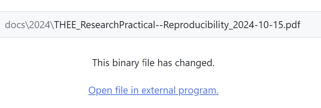
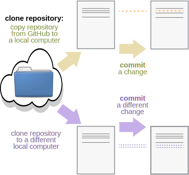
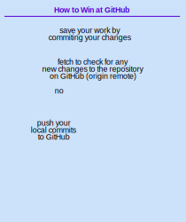

# Attribution

This module is based on the ["Version control with Git" lesson](https://swcarpentry.github.io/git-novice/) developed by [The Carpentries](https://carpentries.org/) under CC BY-SA 4.0: modifications were made to explain how Git is used with GitHub Desktop.

I strongly recommend walking yourself through [their lesson](https://swcarpentry.github.io/git-novice/) if you want to learn more about Git.

# Learning Goals

* What is Git & how can I track my changes locally?

* What is GitHub & how can I track my changes remotely?

* How are Git & GitHub related to [the reproducibility practices we learned about in the first half](reproducibility_half.html)?

# Version control

Keeping track of the changes made to a document can go like:

{width=35%}

Programs can automatically track the changes made to a document (e.g., Google docs):

{width=90% title="Figure modified from https://swcarpentry.github.io/git-novice"}

## What is Git?

{width=90% title="Figure modified from https://swcarpentry.github.io/git-novice"}

*Git tracks the changes made to all files and subfolders* contained in a specific parent folder, called the **repository**.

For *text files*, Git lets you see line-by-line changes:\

{width=35%}

For *non-text files*, Git indicates that files were changed:\

{width=50%}

> Git can be used locally on your computer\
> &nbsp;&nbsp;&nbsp; **AND**\
> Git can be synchronized with a server so that data & changes are backed up to the cloud.

{width=90% title="Figure modified from https://swcarpentry.github.io/git-novice"}

# Using Git Locally

Git can be run via command line ([see tutorial here](https://swcarpentry.github.io/git-novice/01-basics.html)) but we will use GitHub Desktop.

## Exercise 1. Stash

* Download and **install GitHub Desktop** at this link: [https://github.com/apps/desktop](https://github.com/apps/desktop)

  - To complete the installation, you will also have to create an account on [GitHub.com](https://github.com/). Your username will be public.
  
  - After you make your GitHub account, authenticate GitHub Desktop by going to\
  **File ➜ Options... ➜ Accounts    ➜     Sign Into GitHub.com**

{width=50%}
  
{width=30%}
  
{width=25%}

* Download this GitHub repository to your local computer: [EvoNerd/THEE_2025reproducibility](https://github.com/EvoNerd/THEE_2025reproducibility)\
**Add ➜ Clone repository...     ➜    URL**

{width=35%}
  
{width=60%}

* Open the "THEE_2025reproducibility" folder locally on your computer (i.e., using File Explorer for Windows, or Finder for Mac).

  - GitHub Desktop will probably save the repository to a folder in your Documents that is called "GitHub".
  
  - You can also navigate to the repository from the start page on GitHub Desktop
  

{width=45%}

  
* Copy the R Notebook file you created before the break to the new repository.

  - **Do you see any changes on GitHub Desktop?**
  

{width=40%}

GitHub Desktop automatically detects all changes in a repository and adds them to the **staging area**.

> When you decide that you have completed a **stash** of work, then you **commit** the stash to the repository with a message.

{width=90%  title="Figure from https://swcarpentry.github.io/git-novice"}

The Git repository contains a time-series of commits. This time-series is called a **branch**.

A repository can have more than one branch, but this makes it more difficult to manage. By convention the main branch of a repository is called `main`.

## Exercise 2. Commit

* Navigate to the GitHub Desktop staging area and commit the R Notebook file you copy/pasted to the repository.

  - GitHub Desktop may prompt you to push to origin or to create a fork -- do **NOT** do either of those things at this time!

{width=30%}

  
* Rename the R Notebook file with your firstname and commit this change too.

{width=30%}

* Navigate to the history tab. Can you figure out how to tag the most recent commit?

{width=40%}

Some commits are especially important (*e.g.*, the last time your code worked properly, the version of your results that you presented for the final presentation, *etc.*)

> **Tags** let you label these important commits.

It's easier to find and return to a tagged commit.

## Exercise 3. Revert

* Tag your most recent commit as `<your firstname's> code`.

{width=30%}

* Open your R Notebook file, delete all of its contents, and save the file. *Don't worry! Git will be able to retrieve it for you!*

* Commit the change.

{width=50%}

* Navigate to the history tab. Can you figure out how to revert the changes made by the most recent commit?

  - **What happens when you revert changes in commit?**

{width=60%}
  
{width=30%}

# GitHub: Using Git with a Server

Google Docs lets us work collaboratively on the same document -- and so does Git!

GitHub pairs the functionality of Git with a remote server, so we can work collaboratively on the files in a repository.

{width=60% title="Figure modified from https://swcarpentry.github.io/git-novice"}

By considering each change (**commit**) to a repository as separate, Git can keep track of different versions of the same repository even when they happen on different local computers.

Then, the different versions can be **merged** back together.

{width=50%  title="Figure from https://swcarpentry.github.io/git-novice"}

>*Uploading* your local commits and merging them *to the server* is called **pushing**.

{width=80% title="Figure modified from https://swcarpentry.github.io/git-novice"}

>*Downloading* the most recent commits *from the server* and merging them locally is called **pulling**.

You can also just **fetch**: ask Git to check if there are any new commits on the server. This will neither upload or download any changes from/to your local computer.

## Exercise 4. Push & Pull

* Send Hermina your GitHub username or email. You should soon receive an email invite to collaborate on the repository.

{width=60%}
  
{width=30%}

* **Push** your local changes to GitHub's server by clicking "Push to Origin".

{width=80%}

* If you try to push but GitHub finds that your local computer does not have the latest commits, it will automatically ask you to **pull** so your local computer is up-to-date.

{width=60%}
  
{width=80%}

* Keep trying to push until you have successfully synchronized your R Notebook file with origin.

* Keep trying to fetch and pull until you have have downloaded all the R Notebook files of the whole class to your local computer.

* Check out how many tags we have now on the repository! You can easily find tagged commits via the GitHub website.

{width=50%}

For text documents, Git keeps track of changes based on the name and line number of a document.

If different commits modify the same line of the same document, Git does not know how to merge. This creates a **conflict**.

{width=90%  title="Figure from https://swcarpentry.github.io/git-novice"}

Git(Hub) will try its best to automatically resolve conflicts for you. When it finds a conflict that it cannot figure out how you it should be resolved, it will ask you to resolve it manually.

Committing your changes often and synchronizing them with the server reduces the likelihood of creating conflicts.

## *Bonus Exercise* Merging Conflicts

* Make a change to the R Notebook file called `reproducibility.Rmd`. Commit the change and push it to GitHub.

  - Did this create a conflict or was Git able to merge it successfully?
  

{width=80%}

  
* Keep making changes, committing, and pushing them until we create a conflict. Let's practice together to merge the conflicts.

* Conflicts can be resolved by telling Git to use all the changes from one commit and drop all the changes from the other commit\
*e.g., we can keep **either** the commit from local main **or** that from GitHub (origin/main)*

{width=80%}

* If we want to keep some parts from **both** of the conflicting commits, we need to open the document in a code or text editor and manually resolve the conflict. Here's what a conflict looks like in Visual Studio Code. It is resolved manually simply by clicking on the change you want to accept.

{width=100%}

* Conflicts are scary but we can easily manage them once we learn how 😌

  - **How can you avoid conflicts?**

{width=60%}

## Ignoring files

Some files are not useful to track but prone to creating conflicts:

- *e.g.,* Files automatically created by your operating system, like`.DS_Store`, `Thumbs.db`, `.Trash`

- *e.g.,* `.RHistory` files ([except for advanced R users](https://www.geeksforgeeks.org/r-language/how-to-access-the-scriptsource-history-in-rstudio/))

You can ignore these file types by going to GitHub Desktop:  **Repository   ➜  Repository Settings...  ➜   Ignored files** and typing in a list of the files or filetypes you want to Git to ignore.\
(... and if that doesn't work, check out [this tutorial: link here.](https://docs.github.com/en/get-started/git-basics/ignoring-files))

# Summary

{width=60%}

* Automated version control is useful.

  - You will have to use GitHub during the research practical
  
  - (other options exist. Servers: *GitLab*. Programs: *mercurial, CVS, Subversion*.)

* Git can be used locally for version control.

* Git can be used with an online server (e.g., GitHub)

  - we experimented with how GitHub helps backups & collaboration
  
  - GitHub can also be used to host & distribute projects\
  *e.g., [this website is hosted on GitHub](https://github.com/EvoNerd/THEE_2025reproducibility) on the branch called "website"*

* Coupling Git with an online server makes reproducibility easy:

  [Hoard](reproducibility_half.html#3_Hoard_)
  

  
  [Share](reproducibility_half.html#4_Share_)

* How does GitHub help us with the other reproducibility principles?

  [Annotate](reproducibility_half.html#1_Annotate_)
  

  
  [Automate](reproducibility_half.html#2_Automate_)

